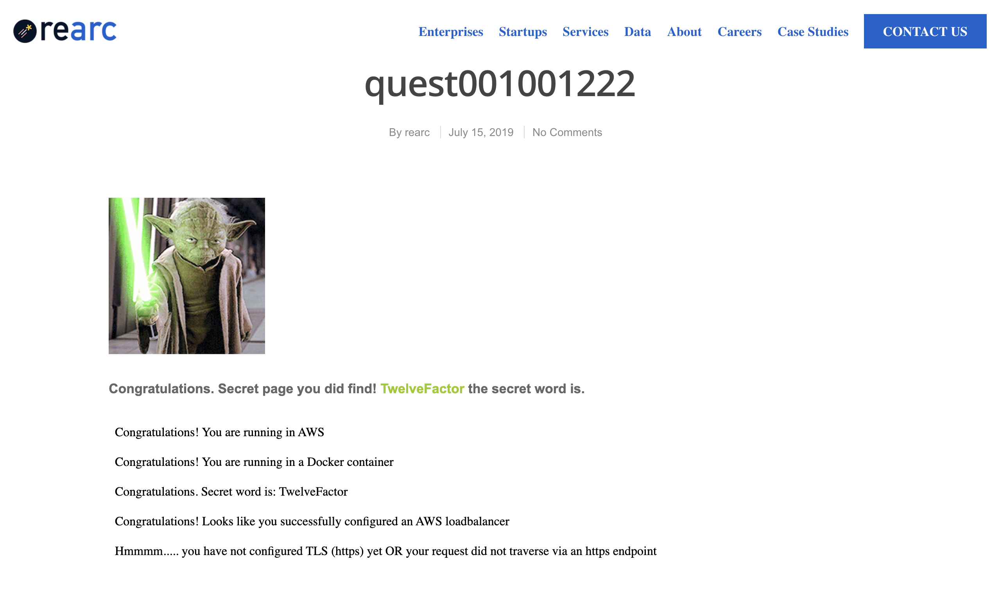

# Rearc Quest

Goal: Run a Dockerized nodejs app on ECS behind a load balancer  
[https://github.com/rearc/quest](https://github.com/rearc/quest)

# Quest Requirements

* ~~If you know how to use git, start a git repository (local-only is acceptable) and commit all of your work to it.~~
* ~~Deploy the app in AWS and navigate to the index page. Use Linux 64-bit as your OS (Amazon Linux preferred).~~
* ~~Deploy the app in a Docker container. Use node:10 as the base image.~~
* ~~Inject an environment variable (SECRET_WORD) in the Docker container. The value of SECRET_WORD should be the secret word discovered on the index page of the application.~~
* ~~Deploy a load balancer in front of the app.~~
* ~~Use Infrastructure as Code (IaC) to "codify" your deployment. Terraform is ideal, but use whatever you know, e.g. CloudFormation, CDK, Deployment Manager, etc.~~
* Add TLS (https). You may use locally-generated certs.

# Approach

The Docker container will be launched as an ECS service.  It will be accessed via the load balancer's DNS.  The ECS infrastructure will be managed via Cloudformation. 

Because of limited time, the priority is to get things working, rather than productionalizing and hardening every aspect of the code. 

This cloudformation template will be reused for this application: https://docs.aws.amazon.com/AWSCloudFormation/latest/UserGuide/quickref-ecs.html

# Prerequisites
1. Bash
2. AWS CLI is configured and can create cloudformation stacks, ecs resources, and an IAM role for the service.
3. An existing VPC and Subnet - these should be passed as parameters to the cloudformation create-stack command.
4. An ECR repo to push the rearc-quest image to.  ECS task definition will be configured to pull from this repo. (The repo creation would be codified in a production setting. This was done manually for time's sake.)

# Instructions

Run the iterate script
```
./iterate.sh
```

Browse to the DNS of the load balancer

# Outcome

## Sources Used
* [Docker & Node](https://nodejs.org/en/docs/guides/nodejs-docker-webapp/)
* [CloudFormation Template](https://docs.aws.amazon.com/AWSCloudFormation/latest/UserGuide/quickref-ecs.html)

## Manual Steps

* The ECR repository is created when the stack is first created, but it's empty.  
* When the ECS service starts, it tires to create a task, but it's pointing to the empty ECR repo, so the task will fail cyclically.
* I do a manual push by running the following commands from the iterate.sh file

```
docker build -t $LOCAL_TAG .

Push image to ECR
ECR_AUTH_ENDPOINT="760219392158.dkr.ecr.us-east-1.amazonaws.com"
ECR_REPO="$ECR_AUTH_ENDPOINT/rearc-test-app-ecrrepo-jfgvzsmgc80k"
aws ecr get-login-password --region us-east-1 | docker login --username AWS --password-stdin $ECR_AUTH_ENDPOINT

docker tag "$LOCAL_TAG:latest" "$ECR_REPO:latest" 
docker push "$ECR_REPO:latest"
```
* After the image is pushed to ECR, the service will work the next time it starts the task.

## Screenshot of the application working

The secret word is *TwelveFactor*. 



